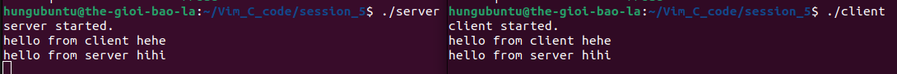

# About this example

In this example, I will implement a conversation between a server and a client.

For each side, I create two separate threads to handle two tasks:

- reading input from the keyboard and sending it;
- receiving messages from the other side and printing them to the screen.

The result is illustrated in the image below:

