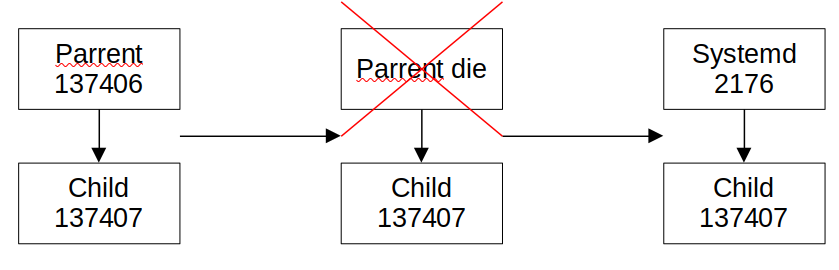

# The purpose of this example is observe orphan process

I will create a child process and then I let the parent process terminate first to observe the child process adopting a new parent process.

```text
Parent PID  = 137406
Child PID = 137407
Parent exiting...
Child PID  = 137407
Child PPID = 2176
```

when parent die first, child process will become orphan and then it has been adopted by another process that registered to adopt it. In that case it is process id 2176.


