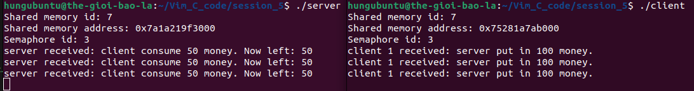

# về ví dụ này

Tôi thực hiện việc sử dụng shared memory 1 struct giữa 2 process: producer và consumer.
Bên cạnh đó, tôi sử dụng 1 semaphore set có 2 semaphore bên trong để tạo đồng bộ giữa 2 bên:

- `sem[0]` dùng cho đánh thức consumer.
- `sem[1]` dùng cho đánh thức producer.

Quá trình thực hiện được mô tả ngắn gọn như sau:

- Bên producer sẽ liên tục tăng biến `money` lên 10 mỗi 1s. Khi giá trị đạt 100, nó sẽ đánh thức consumer thông qua semaphore `sem[0]` và đợi tín hiệu đánh thức từ `sem[1]`.
- Bên consumer chờ tín hiệu đánh thức `sem[0]`, sau đó thực hiện việc trừ 50 từ biến `money`, sau khi thực hiện xong, nó đánh thức producer thông qua `sem[1]`.

Kết quả được minh họa như hình bên dưới:

